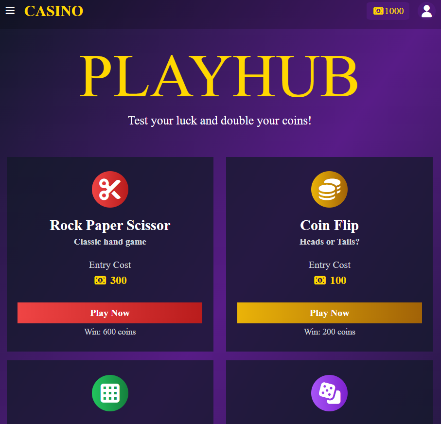
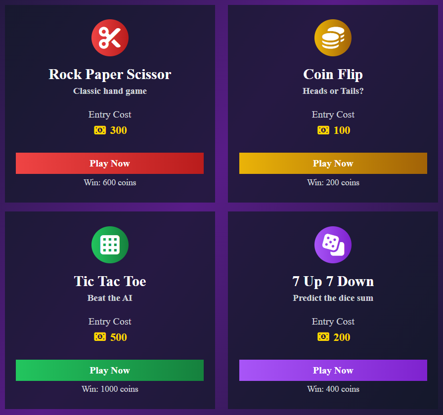
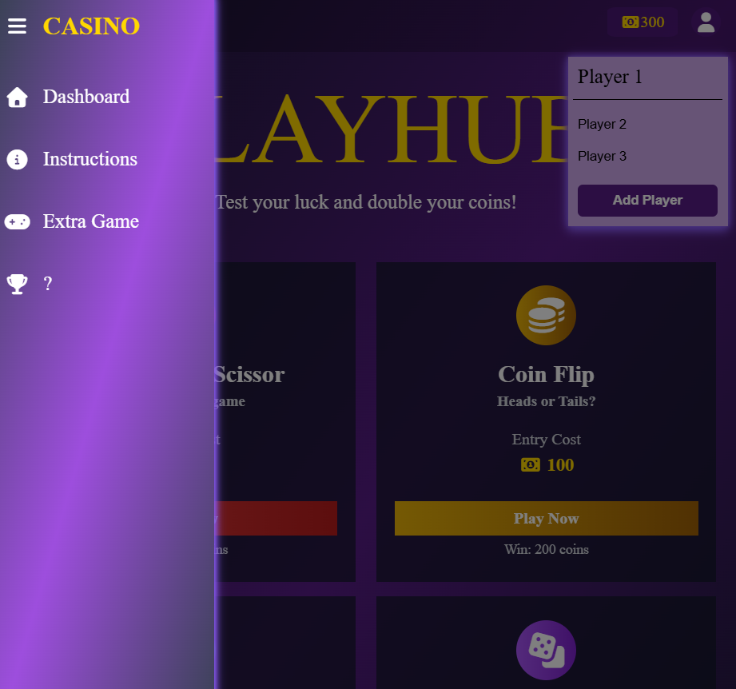
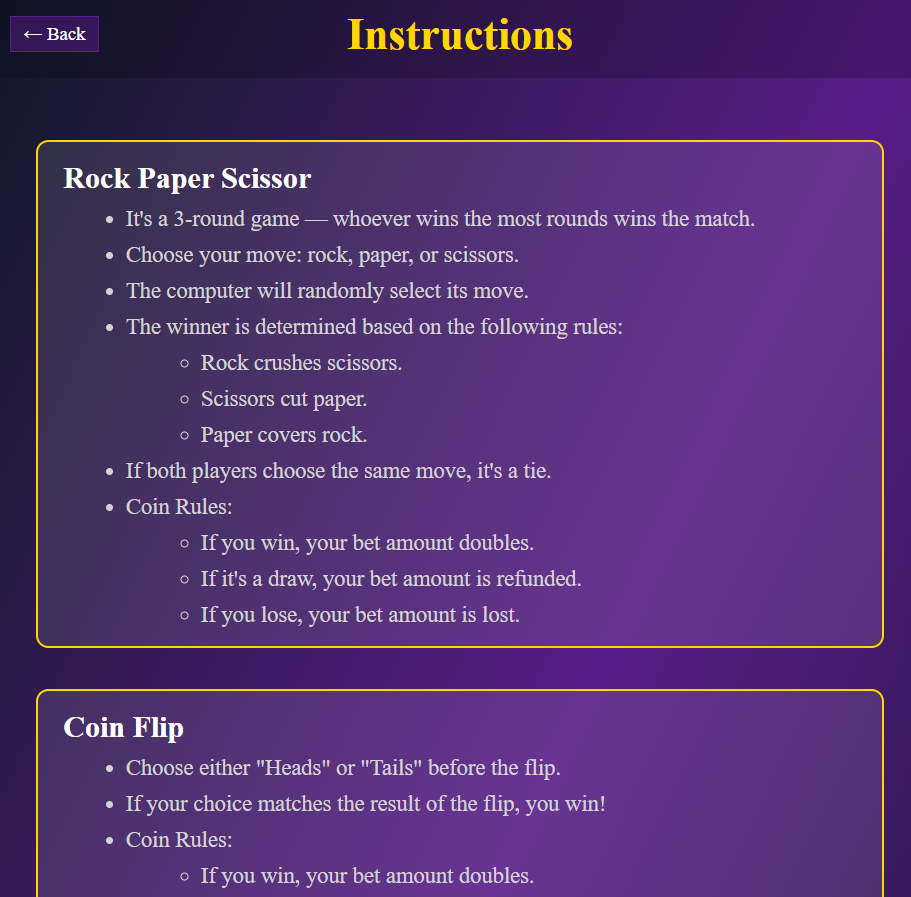

# 🎰 PlayHub

A browser-based casino mini-game hub where players can bet coins across four classic games. Test your luck, beat the odds, and grow your balance — or lose it all trying.

<p align="center"></p>

---

## 📖 Table of Contents

- [Overview](#overview)
- [Features](#features)
- [Games](#games)
- [Coin System](#coin-system)
- [Multi-Player](#multi-player)
- [Navigation & Sidebar](#navigation--sidebar)
- [Instructions Page](#instructions-page)
- [Project Structure](#project-structure)
- [Getting Started](#getting-started)
- [Future Updates](#future-updates)

---

## Overview

PlayHub is a front-end web application built with HTML, CSS, and vanilla JavaScript. Players start with **1000 coins** and use them to enter games. Win and double your entry — lose and it's gone. Balances persist across sessions using `localStorage`.

---

## ✨ Features

- 🎮 **4 playable mini-games** with unique entry costs and payouts
- 💰 **Coin betting system** with real-time balance tracking
- 👥 **Multi-player support** — switch between players, each with their own balance
- 📋 **Instructions page** explaining how the platform works
- 🗂️ **Collapsible sidebar** for easy navigation
- 💾 **Persistent storage** via `localStorage` — balances are saved between sessions
- ✨ **Glowing purple UI** with smooth hover effects and transitions

---

## 🎮 Games

| Game | Entry Cost | Payout (Win) | Description |
|------|-----------|--------------|-------------|
| ✂️ Rock Paper Scissors | 300 coins | 600 coins | Classic hand game against the computer |
| 🪙 Coin Flip | 100 coins | 200 coins | Call heads or tails |
| ⬛ Tic Tac Toe | 500 coins | 1000 coins | Beat the AI in a 3×3 grid |
| 🎲 7 Up 7 Down | 200 coins | 400 coins | Predict if two dice sum above, below, or equal to 7 |

> ⚠️ You must have enough coins to cover the entry cost before entering a game. If your balance is too low, you'll be blocked from entering.

<p align="left"></p>

---

## 💰 Coin System

- Every player starts with **1000 coins**
- Entry fees are **deducted immediately** when clicking "Play Now"
- Winning a game **returns double the entry cost** to your balance
- Losing means **the entry fee is forfeited**
- Balances are stored in `localStorage` and persist across page reloads
- A live balance display is shown in the navbar at all times

---

## 👥 Multi-Player

PlayHub supports multiple player profiles:

- Up to **3 default players** (Player 1, Player 2, Player 3), each with independent balances
- Switch players via the **profile icon** (top-right) to open the player menu
- The **current active player** is shown at the top of the menu
- Clicking another player's name swaps them to the active slot
- An **"Add Player"** button is available for expanding the roster
- All player data is saved to `localStorage` as a JSON array

---

## 🗂️ Navigation & Sidebar

The sidebar can be opened via the **hamburger menu (☰)** in the top-left of the navbar.

<p align="left"></p>

Sidebar links include:

- 🏠 **Dashboard** — Return to the main game hub
- ℹ️ **Instructions** — Learn how the platform works
- 🎮 **Extra Game** — Placeholder for a future game
- 🏆 **?** — Mystery section (coming soon)

The sidebar overlays the page with a dark backdrop and closes when clicking any link or the overlay itself.

---

## 📋 Instructions Page

A dedicated `Instruction.html` page explains the rules of each game and how the coin system works. Accessible from the sidebar at any time.

<p align="left"></p>

Rules covered per game:
- How rounds are played and how winners are determined
- What happens on a draw (RPS refunds your bet)
- Coin rules: win doubles your bet, lose forfeits it

---

## 📁 Project Structure

```
CASINO/
│
└── Casino/
    │
    ├── index.html                  # Main dashboard / game hub
    ├── index-style.css             # Global styles
    ├── index.js                    # Dashboard logic (balance, players, navigation)
    │
    ├── rps.html                    # Rock Paper Scissors game
    ├── rps-style.css               # RPS styles
    ├── rps.js                      # RPS game logic
    │
    ├── coinflip.html               # Coin Flip game
    ├── coinflip-style.css          # Coin Flip styles
    ├── cf.js                       # Coin Flip game logic
    │
    ├── ttt.html                    # Tic Tac Toe game
    ├── ttt-style.css               # Tic Tac Toe styles
    ├── ttt.js                      # Tic Tac Toe game logic
    │
    ├── 7up.html                    # 7 Up 7 Down game
    ├── 7up-style.css               # 7 Up 7 Down styles
    ├── 7up.js                      # 7 Up 7 Down game logic
    │
    ├── Instruction.html            # How-to / rules page
    ├── Instructions.css            # Instructions page styles
    │
    ├── Here are all the colors.txt # Color reference / design notes
    ├── Casino.cpp                  # (misc / legacy file)
    ├── Casino.exe                  # (misc / legacy file)
    │
    ├── screenshot_main.png         # README screenshot
    ├── screenshot_games.png        # README screenshot
    ├── screenshot_sidebar.png      # README screenshot
    ├── screenshot_instructions.png # README screenshot
    │
    └── README.md                   # Project documentation
```

---

## 🚀 Getting Started

No build tools or dependencies required. Just open the project in a browser:

1. **Clone or download** the repository
2. Open `index.html` in any modern web browser
3. Start with your **1000 default coins** and pick a game!

> 💡 **Tip:** Use browser DevTools → Application → Local Storage to inspect or reset player balances during development.

---

## 🛠️ Built With

- **HTML5** — Structure and markup
- **CSS3** — Styling, animations, and responsive layout
- **Vanilla JavaScript** — Game logic, DOM manipulation, localStorage
- **[Font Awesome 7](https://fontawesome.com/)** — Icons

---

## 🔮 Future Updates

- [ ] 🐛 **Fix "Add Player" button** — currently a placeholder with no functionality
- [ ] 📱 **Responsive design** — optimise layout for mobile and different screen sizes
- [ ] 🎁 **Free daily game** — a no-cost game to earn coins and keep players engaged
- [ ] 🏆 **Leaderboard** — track and display top players ranked by balance

---

## 📌 Notes

- The project uses `localStorage` for persistence — clearing browser data will reset all balances to 1000
- The "Add Player" button and some sidebar links are placeholders pending full implementation
- Designed for desktop; mobile responsiveness may vary
